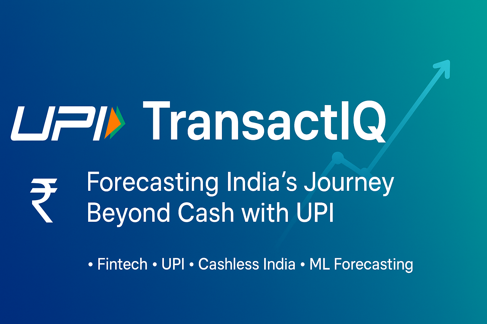

# **TransactIQ: Forecasting India’s Journey Beyond Cash with UPI**
<!------>

  
   

**TransactIQ** is a data-driven project analyzing and forecasting India’s transition to a cashless economy through UPI adoption. Using real data sets (NPCI, RBI, World Bank), exploring trends, patterns, and future predictions of digital payments in India. 

## **Objectives-**  
- Analyze UPI transaction growth in India.  
- Compare UPI with traditional cash/card-based payments.  
- Forecast future trends using ML models.  
- Visualize adoption patterns across industries and demographics.

## **Table of Contents-**
  1. Project Overview
  2. Data Sources
  3. Data Collection & Merging
  4. Data Cleaning & Preprocessing
  5. Exploratory Data Analysis (EDA)
  6. Visualization & Dashboards
  7. Machine Learning & Forecasting (optional)
  8. Insights & Key Findings
  9. Conclusion & Future Work

## **1.Project Overview**
