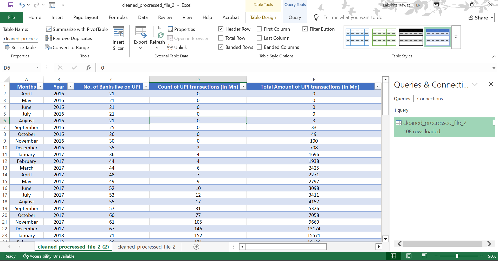

# **TransactIQ: Forecasting India’s Journey Beyond Cash with UPI**

   
  
   
**TransactIQ** is a data-driven project analyzing and forecasting India’s transition to a cashless economy through UPI adoption. Using real data sets (NPCI, RBI, World Bank), exploring trends, patterns, and future predictions of digital payments in India. 

**Unified Payments Interface (UPI)** is a system that enables multiple bank accounts to be linked to a single mobile app, allowing for easy fund transfers, merchant payments, and peer-to-peer transactions. It was launched as a pilot by NPCI with **21 member banks on 11th April 2016 in Mumbai**, inaugurated by **Dr. Raghuram G. Rajan**, then RBI Governor. Soon after, banks started releasing UPI-enabled apps on the Google Play Store.

## Table of Contents 
  1. Project Overview 
  2. Data Sources
  3. Data Collection & Merging
  4. Data Cleaning & Preprocessing
  5. Exploratory Data Analysis (EDA)           
  6. Visualization & Dashboards
  7. Forecasting using Time Series Model
  8. Conclusion

## **1. Project Overview**
- ### **Objectives**
- Analyze UPI transaction growth in India
- Compare UPI with traditional cash/card-based payments  
- Forecast future trends using ML models
- Drawing insights and conclusions on the shift towards digital payments
  
## 2. Data Sources
The dataset for this project was obtained from the official **NPCI (National Payments Corporation of India) UPI Statistics Portal** [Website](https://www.npci.org.in/what-we-do/upi/upi-ecosystem-statistics). It is an umbrella organization that operates retail and settlement payment systems in India, including UPI, RuPay, FASTag, and other payment systems.
For this project, data from **April 2016 to April 2025** has been compiled by consolidating the annual Excel files available on the NPCI website into a single, structured dataset. This ensures accuracy, transparency, and completeness of information for analysis.

## 3. Data Collection & Merging
The monthly UPI statistics from **April 2016 to April 2025** were collected from the official NPCI website and merged into a single dataset. The merging and processing were carried out in Python using libraries such as **pandas** (for data manipulation and merging), **openpyxl** (for handling Excel files), and **glob** (for retrieving file paths and iterating through multiple Excel files). The complete code implementation is provided in the attached **Jupyter Notebook** (.ipynb) file, and the final consolidated dataset is exported and attached as an **Excel** (.xlsx) file for reference.

### **Jupyter File**
<iframe src="notebooks/Merged_excel_files.html" width="100%" height="800px"></iframe> 

### **Merged Excel File**  ([File](https://github.com/lakshita-03/TransactIQ/blob/main/data/npci_upi_stats.csv))

## 4. Data Processing and Cleaning   ([Processed File](https://github.com/lakshita-03/TransactIQ/blob/main/data/cleaned_procressed_file_2.csv))
The dataset was cleaned and prepared using **Power Query**, as it provided an efficient and user-friendly approach for managing the available data. Several preprocessing steps were carried out to ensure data quality and consistency:
- Removal of unwanted columns that were not relevant for analysis.
- Conversion of data types to appropriate formats, such as dates and numeric values.
- Sorting of data to maintain a proper chronological sequence.
- Elimination of duplicates and extra values to avoid redundancy.

  
### **Raw Data (Before Cleaning)**  

  
 
### **Cleaned Data (After Processing)**  

  
   
 
   

## 5. Exploratory Data Analysis (EDA)
Exploratory Data Analysis (EDA) was carried out to understand the structure, patterns, and key insights from the dataset. The objective of this stage was to examine trends, detect anomalies, and establish relationships between variables before proceeding to a deeper interpretation.

### **Dataset Overview**
- Number of Banks live on UPI (monthly count of banks adopting UPI)
- Count of UPI transactions (In Mn) –The number of transactions done through UPI (**Volume**)
- Total Amount of UPI transactions (In Mn) – The total money involved in the transactions (**Value**)
- Granularity: Month-wise breakdown across all years, which also allows for aggregated year-wise analysis

## _EDA on UPI Adoption and Comparative Analysis with Cash and Card Payments_
<iframe src="notebooks/EDA.html" width="100%" height="800px"></iframe>    
  

**Key Insights from the EDA on UPI Transactions**
- **Strong Growth in Adoption** – UPI transactions have shown exponential growth from 2016 onwards, clearly reflecting rapid adoption across India.
- **Seasonality & Peaks** – Certain months (especially around festive seasons and year-end) witness higher transaction counts, showing consumer-driven seasonal effects.
- **Impact of COVID-19** – During 2020–2021, digital payments accelerated as cash usage declined, boosting UPI adoption significantly.
- **Bank Participation** – The number of banks going live on UPI increased year by year, contributing to wider accessibility and usage.
- **Yearly Trend** – Each year records a higher total transaction volume compared to the previous, confirming UPI adoption is consistently increasing.
- **Correlation Analysis** – Strong positive correlation between the number of live banks, transaction count, and transaction value, indicating that wider bank integration  directly boosts UPI adoption.

## _Exploring UPI, Card, and Cash Payment Trends_
The dataset for this section has been extracted from the **Reserve Bank of India’s (RBI) Database on Indian Economy (DBIE)** under the **Payment and Settlement Systems section** [Website](https://bit.ly/45Pf2iU). It provides monthly and yearly statistics on transaction volumes and values across various payment modes, including UPI, Card, and Cash, covering the period from November 2019 to June 2025. Data cleaning and preparation were carried out in **Power Query**, which ensured both efficiency and simplicity in managing the dataset.

## **Dataset Overview**
- UPI Transactions-Volume(Lakh)- Total count of UPI transactions
- UPI Transactions-Value(Crores)- Total amount of UPI transactions
- Card Payments-Volume(Lakh)- Total count of Card Payments
- Card Payments-Value(Crores)- Total amount of Card Payments
- Cash Payments-Volume(Lakh)- Total count of Cash Payments
- Cash Payments-Value(Crores)- Total amount of Cash Payments
  
[**Unprocessed Data**](https://github.com/lakshita-03/TransactIQ/blob/main/data/rbi_old.csv)

[**Processed Data**](https://github.com/lakshita-03/TransactIQ/blob/main/data/rbi_processed_2.csv)
  
### **Jupyter File**
<iframe src="notebooks/EDA_2.html" width="100%" height="800px"></iframe> 
  

**Key Insights from the comparison**
- **During COVID-19 (2020–21)**: Digital adoption accelerated due to social distancing and contactless payments. UPI volumes saw a sharp rise, while cash usage declined and  card payments grew modestly.
- **Post-COVID (2022 onwards)**: UPI continued to boom, becoming the dominant mode of payment, reflecting a structural shift in consumer behavior towards digital.
- Cash usage has remained relatively stagnant/declining, but it still holds importance in rural and informal markets. Card payments exhibit steady but slower growth, while UPI transactions have grown exponentially, underscoring their role in driving India’s cashless economy.
 **However, India cannot become fully cashless yet, as cash remains crucial for segments of the population with limited digital access.**
 
## 6. Interactive Visualizations & Dashboard
<iframe title="correct" width="1000" height="373.5" src="https://app.powerbi.com/view?r=eyJrIjoiNTg5MWJiZjgtMWIwYS00YTRmLTk4MDItNDU1MzVkOGEyZDY0IiwidCI6IjY1MTBmNjlkLWMzZjUtNDIxZi04ZGZlLWUxZDJiYzk3ZjI3NSJ9" frameborder="0" allowFullScreen="true"></iframe>

 
## 7. Forecasting using Time Series Models (ARIMA)

### Jupyter File
<iframe src="notebooks/ARIMA.html" width="100%" height="800px"></iframe>

## 8. Conclusion
- **Exponential Growth (2016–2025)** – UPI began on a small scale in 2016 but expanded exponentially, especially after 2018, with the push for digital adoption.
Shift from Cash to Digital – Cash and card payments are being overshadowed by UPI, which emerged as India’s default mode of digital payments, accelerated by COVID-19.
- **Seasonality & Events** – Spikes in UPI transactions align with festive periods (Diwali, year-end, March financial close), while dips reflect disruptions such as the 2020 lockdown.
- **Forecasting Trends** – Forecasts (Prophet & ARIMA) suggest sustained growth till 2025, with recurring seasonal peaks and minor early-year dips.
- **Businesses and Financial Impact**- Businesses should align sales and marketing campaigns with high-transaction months (festive & year-end), leveraging UPI spikes for    customer engagement. Financial institutions can design innovative UPI-linked products (credit on UPI, loyalty rewards) to strengthen customer retention. **Government & policymakers** can use UPI to push deeper financial inclusion by reaching rural and underserved populations.
- **Cashless Limitation** – Despite UPI’s dominance, a fully cashless India is not yet possible. In rural and underdeveloped areas, where digital infrastructure and literacy remain limited, cash continues to play a vital role.
- **Final Takeaway**– UPI has revolutionized India’s digital economy, becoming the backbone of cashless transactions, while coexisting with cash in regions where digital reach is still evolving.
 
[**Github Link**](https://github.com/lakshita-03/TransactIQ)
  

