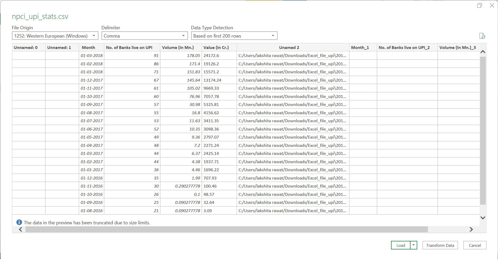
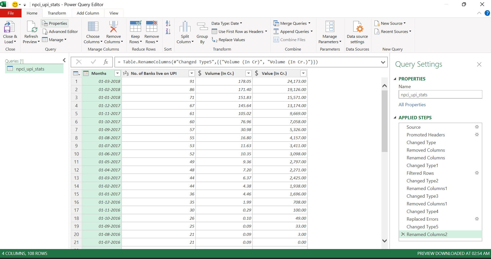

# **TransactIQ: Forecasting India’s Journey Beyond Cash with UPI**

   
  
   
**TransactIQ** is a data-driven project analyzing and forecasting India’s transition to a cashless economy through UPI adoption. Using real data sets (NPCI, RBI, World Bank), exploring trends, patterns, and future predictions of digital payments in India. 

## Table of Contents 
  1. Project Overview
  2. Data Sources
  3. Data Collection & Merging
  4. Data Cleaning & Preprocessing
  5. Exploratory Data Analysis (EDA)           **(EDIT KARNA HAI ABHIIIII)**
  6. Visualization & Dashboards
  7. Machine Learning & Forecasting (optional)
  8. Insights & Key Findings
  9. Conclusion & Future Work

## **1. Project Overview**
- ### **Objectives**
1. Analyze UPI transaction growth in India.
2. Compare UPI with traditional cash/card-based payments.
3. Forecast future trends using ML models.
4. Visualize adoption patterns across industries and demographics.

## 2. Data Sources
The dataset for this project was obtained from the official **NPCI (National Payments Corporation of India) UPI Statistics Portal** (https://www.npci.org.in/what-we-do/upi/upi-ecosystem-statistics). It is an umbrella organization that operates retail and settlement payment systems in India, including UPI, RuPay, FASTag, and other payment systems.
For this project, data from **2016 to 2025** has been compiled by consolidating the annual Excel files available on the NPCI website into a single, structured dataset. This ensures accuracy, transparency, and completeness of information for analysis.

## 3. Data Collection & Merging
The monthly UPI statistics from **April 2016 to March 2025** were collected from the official NPCI website and merged into a single dataset. The merging and processing were carried out in Python using libraries such as **pandas** (for data manipulation and merging), **openpyxl** (for handling Excel files), and **glob** (for retrieving file paths and iterating through multiple Excel files). The complete code implementation is provided in the attached **Jupyter Notebook** (.ipynb) file, and the final consolidated dataset is exported and attached as an **Excel** (.xlsx) file for reference.

### **Jupyter File**
<iframe src="notebooks/Merged_excel_files.html" width="100%" height="800px"></iframe> 

### **Merged Excel File**  ([File](https://github.com/lakshita-03/TransactIQ/blob/main/data/npci_upi_stats.csv))

### 4. Data Processing and Cleaning   ([Processed File](https://github.com/lakshita-03/TransactIQ/blob/main/data/cleaned_procressed_file_2.csv))
The dataset was cleaned and prepared using **Power Query**, as it provided an efficient and user-friendly approach for managing the available data. Several preprocessing steps were carried out to ensure data quality and consistency:
- Removal of unwanted columns that were not relevant for analysis.
- Conversion of data types to appropriate formats, such as dates and numeric values.
- Sorting of data to maintain a proper chronological sequence.
- Elimination of duplicates and extra values to avoid redundancy.

 
  
## **Raw Data (Before Cleaning)**  

  
 
## **Cleaned Data (After Processing)**  

  
  
  
 

 ## 5. Exploratory Data Analysis(EDA)
Exploratory Data Analysis (EDA) was carried out to understand the structure, patterns, and key insights from the dataset. The objective of this stage was to examine trends, detect anomalies, and establish relationships between variables before proceeding to a deeper interpretation.
### 1. **Dataset Overview**
- Number of Banks live on UPI (monthly count of banks adopting UPI).
- Volume of UPI transactions (in crores) –The number of transactions done through UPI (count).
- Value of UPI transactions (in crores) – The total money involved in the transactions.
- Granularity: Month-wise breakdown across all years, which also allows for aggregated year-wise analysis.

                                      

